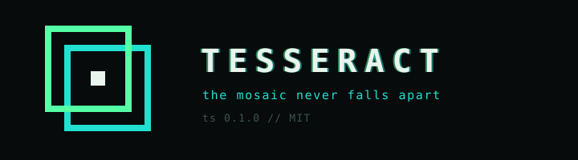
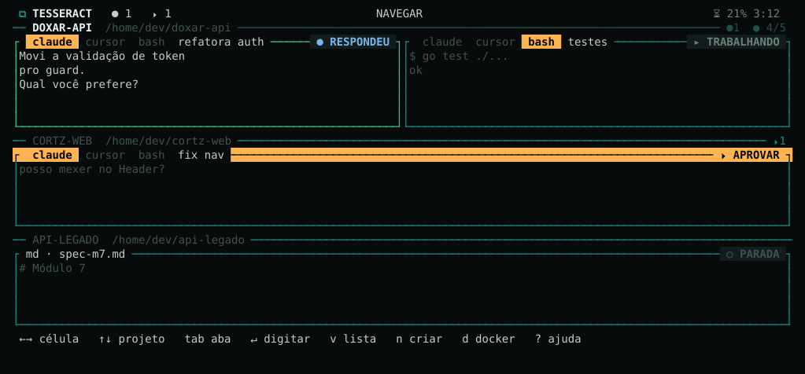

<p align="center">
  
</p>

<p align="center">
  <a href="LICENSE"></a>
  <a href="https://github.com/AndreLuizMMS/tesseract/releases"></a>
  <a href="#instalar"></a>
</p>

<br>

Several AI agents running side by side in a single grid. Claude Code, Cursor CLI, shells,
Docker logs and markdown, each in a living cell, all visible at the same time — no tabs,
no switching, no finding out too late that one of them is stuck waiting for a yes.
Underneath, an engine that's a service on your account: you close the screen and the work
keeps going, the machine reboots and the grid comes back in the same positions, with the
conversations picked back up.

<p align="center">
  
</p>

`⬤ answered` has something to read. `⏵ approve` **won't move** without you — and it's the
only signal that turns into a solid bar across the whole line, blinking, because urgency
here is filled area, not color. Works from a distance, out of the corner of your eye, and
with `NO_COLOR=1`.

## Install

```bash
curl -fsSL https://raw.githubusercontent.com/AndreLuizMMS/tesseract/main/install.sh | bash
```

One line. The installer downloads Go if the machine doesn't have a usable one, compiles
the `ts` command, installs the user service and starts the engine. **Updating is running
the same line.**

Then, inside any project:

```bash
ts
```

## Shortcuts

Moving around is only with the arrows — no letter touches the grid. `↵` enters the cell and
**every** key becomes hers; `ctrl-l` gives back the keyboard. `?` opens the map on screen.

**[The full keyboard map →](docs/atalhos.md)**

## Documentation

| | |
|---|---|
| [Manual](docs/manual.md) | projects, cells, the two modes, Docker, configuration |
| [Shortcuts](docs/atalhos.md) | the whole keyboard and the command line |

## License

MIT.
