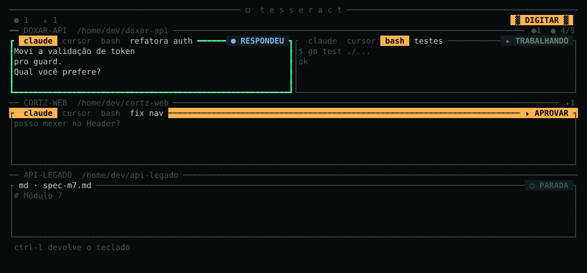

# Manual

## How it works

There are exactly **three things**.

### Project

A directory. Born together with its first cell — creating a project and creating a cell are
the same gesture — and **leaves the screen when its last cell dies**. The disk is never
touched: the project leaving the screen doesn't delete, move or change anything.

### Cell

The unit of work. **One rule for all of them**: the same key creates, kills, renames,
focuses and navigates any of them.

Creating doesn't ask what the cell is going to be. A **session** is born with four tabs
inside, all in the project's directory, and `tab` switches between them. Only the tab
you're using has a process: the others come up when you get to them.

| Tab | What it is |
|---|---|
| `claude` | Claude Code |
| `cursor` | Cursor CLI |
| `bash` | a shell |
| `md` | the project's markdown files: a list with search by name, and the chosen one rendered |

The `md` tab opens on a list of every markdown file in the project, with a **search bar at
the top**. Enter TYPE mode (`↵`), type part of the name to filter, `↑↓` picks and `↵` opens
the file. `esc` goes back to the list. The open file reloads itself when the disk changes —
you can watch the agent writing the spec right beside it.

The document is drawn **as a page, not as terminal output**: fixed, centered reading width,
margins on both sides, title in a banner, sections with a rule, blockquote with a bar,
table with a thin ruler and code in its own box. A code line wider than the page is
**cut with `›`**, never wrapped — a diagram split down the middle isn't readable.

There are also two cell types that aren't sessions:

| Type | What it is |
|---|---|
| `logs` | live log of a compose service, created by the Docker panel |
| `md` | a specific markdown file, when you fill the MD field at creation |

Every cell has a state, and that's what shows up on the marker. Every state has **three**
signals at once — a glyph, a color and a shape — so that none of them is indispensable:

| Signal | State | What to do |
|---|---|---|
| `▸ WORKING` | live process producing | nothing — let it work |
| `⬤ ANSWERED` | gave back its turn, has a response waiting to be read | read when you can; nothing is blocked |
| `⏵ APPROVE` | stuck on a question and **won't move** without an answer | answer: the work stopped here |
| `✖ CRASHED` | the process died on its own | `r` brings it back up |
| `○ STOPPED` | no process, cell preserved | `r` resumes from where it stopped |
| `⚠ ORPHAN` | the project's directory disappeared from disk | recreate the path or kill the cell |

`⏵ APPROVE` is the only one that turns into a **solid, inverted bar filling the whole line**
of the cell's header, and the only one that **blinks** — 1.8s on, 200ms off, forever, while
someone is waiting on you. The other five are a glyph and a label, still. It's on purpose:
urgency here is filled area, not hue — it works from a distance, works out of the corner of
your eye and works with no color at all.

In the off frame the bar **stays a bar**: only the background changes. The filled area is
what says "this is blocking the work", and it never disappears. And the clock only exists
while there's a blocked cell — with none, the screen stays completely still.
`TESSERACT_SEM_PISCA=1` turns off the blink for those who prefer a still screen.

**Answered ≠ approve.** That's the distinction that makes the alarm worth something: an
agent stuck on a question blocks the work; an agent that finished its turn just has
something to read.

And **no false alarms**: a blinking spinner and a moving cursor don't count as activity.
The engine requires consecutive reads of work before arming the alert, and consecutive
reads of silence before declaring the turn over.

### Docker panel

Belongs to the **project**, not the cell. The compose file is looked for at the root and in
first-level folders — because a real project keeps its stack in `docker/`, `infra/` and
the like — and **a production file is never chosen**. The panel lists the services with
state, port, health and uptime; brings up, stops, restarts and rebuilds a service or the
whole stack; and turns a service's log into a mosaic cell.

While Docker is working, the panel says what it's doing and keeps updating the list — the
services turn green one at a time instead of everything changing at once at the end.

**No destructive action exists here.** There's no `down -v`, no deleting a volume.

## The two modes

<p align="center">
  
</p>

By default you're in **NAVIGATE**: every key belongs to the app.

`↵` enters **TYPE**: every key belongs to the cell, **with no exception whatsoever**. Not
`q`, not `D`, not `tab`, not the arrows. `ctrl-l` gives back the keyboard.

Pasting (`ctrl-v`, or whatever your terminal uses) works in TYPE mode and in text fields.
The text goes in **marked as a paste**: a multi-line prompt enters whole into the agent's
box, instead of each line break becoming a send. In a single-line field — the project's
path, the `p` prompt — the paste gets flattened into one line.

There's never two owners of the keyboard at the same time — so shortcut collision is
structurally impossible. And the mode is impossible to get wrong, because it changes
**four** things at once:

1. the screen background darkens and the rest dims;
2. the focused cell's border thickens and doubles;
3. the `▓ TYPE ▓` badge appears reversed;
4. the cell holding the keyboard turns **phosphor green** — and it's the only phosphor
   green on the screen.

With `NO_COLOR=1` signals 1 and 4 disappear, and signals 2 and 3 stay: double border and
reversed badge don't depend on color at all.

## Copying what the agent wrote

With the mosaic, the terminal's own selection doesn't work: it grabs the neighbors and the
borders too. So the mark is Tesseract's own. **Drag the mouse over the cell** — the section
lights up — and **release**: the text goes to the clipboard, with no color and no trailing
spaces at the end of lines. Works in both modes and both drag directions. `esc` clears the
mark.

Clicking without dragging only picks the cell; it doesn't touch whatever you'd copied
before. To grab something that already scrolled off screen, **scroll first** (mouse wheel)
and then drag — the mark works on what's in view.

## Configuration

Optional, at `~/.config/tesseract/config.json`. Without the file, everything works with the
defaults.

```json
{
  "editor": "codium",
  "som": true,
  "notificar": true,
  "comandoNotificacao": "",
  "tetoHistorico": 5242880,
  "agentes": {
    "claude": {
      "programa": "claude",
      "args": ["--model", "opus"],
      "comandoRenomear": "/rename"
    }
  }
}
```

The **usage badge** for the 5-hour window shows up in the title bar when your Claude Code
statusline writes `~/.claude/tesseract-quota.json` (or the old `squad-quota.json`) in the
format `{"used_percentage": 59, "resets_at": 1786955400}`. Without the file, everything
still works — the badge just doesn't show up.

## Who runs inside a cell

Every process Tesseract starts gets `TESSERACT=1` in the environment. It can't paint an
agent's interface — what the cell shows is what the process wrote, and nothing more. What
it can do is say "you're in here", and let whoever cares dress accordingly.

Claude Code's statusline is the typical case: it's a command of yours, runs inside the
cell's pty, inherits the environment and can open the line with `⧉` and use Tesseract's
palette when the variable is set. Outside Tesseract, nothing changes — the brand
introduces itself, it doesn't impose itself.

```bash
[ -n "${TESSERACT:-}" ] && echo "this session is inside a cell"
```
